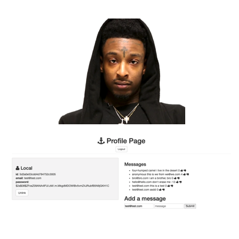

# 21 Savage Fan Site (Authentication Version)

- Full-stack Web App using **Passport.js**, **Express.js**, **Node.js**, and **MongoDB**.
- Some dependencies used: *EJS*, *Body-Parser*  
- **CRUD** functionality: Create ("post"), Read ("get"), Update ("put"), and Delete ("delete")

## Purpose

- Corrected non-working version from Leon Noel's Repo @ https://github.com/leonnoel
- Added thumbs down functionality
- Changed to personal database at MongoDB Atlas

## Installation

1. Clone repo
2. run `npm install`

## Usage

1. Open terminal
2. Change directory to 21-savage-demo folder
2. Run `node server.js`
3. In Browser, navigate to `localhost:8080`
